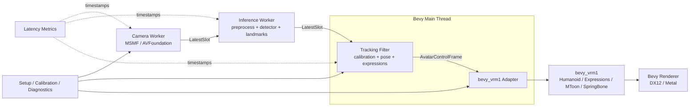

# Bevy + bevy_vrm1によるフルRust VTuberアプリ 詳細設計書

文書版: 2.1
基準日: 2026-08-14
対象VRM: VRM 0.xおよびVRM 1.0
対象OS: Windows 11 x86_64、macOS 13以降
描画基盤: Bevy 0.19.0
VRMランタイム: `bevy_vrm1` 0.9.1相当、Git revision固定
主要用途: Webカメラによる単一人物の顔追跡とVRMアバター制御
実装担当想定: AI_AGENT

---

## 1. 文書の目的

本書は、Webカメラから一人分の顔を追跡し、その結果でVRM 0.xまたはVRM 1.0モデルの頭、首、眼、まばたき、口形状を動かす基本的なVTuberアプリを、WindowsおよびmacOS向けに原則Rustだけで構築するための実装契約である。

本書は概念説明ではなく、AI_AGENTが段階的に実装し、各段階をテスト可能な単位で完了させるための詳細設計として扱う。次を明確に定義する。

- 製品スコープと非スコープ
- 採用ライブラリとバージョン固定方針
- workspaceとcrateの責務境界
- カメラ、推論、追跡、アバター制御間のデータ契約
- スレッド、キュー、時刻、停止処理
- 顔検出、ランドマーク、頭部姿勢、表情係数、フィルタ
- `bevy_vrm1`への接続方法
- BevyとVRM仕様に沿ったsystem実行順序
- WindowsとmacOSの差分
- モデル互換性、既知制約、upstream修正方針
- テスト、性能計測、パッケージング
- AI_AGENT向けの実装順序と受入条件

VRM処理は既存の`bevy_vrm1`実行系へ集約する。VRM 0.xについては、vendor互換レイヤーが`extensions.VRM`を共通runtime descriptorへ正規化してから同じregistry、scene初期化、Humanoid、Expression、MToon、SpringBone、Node Constraint経路へ渡す。アプリ固有コードは、顔追跡結果を同crateの公開APIとBevy ECSへ適用するアダプター、モデル取込前の世代非依存preflight、および互換性試験に限定する。別のVRMローダー、別アバター実行系、Humanoid runtime、MToon、Expression、SpringBone、Node Constraintは実装しない。

---

## 2. 設計上の結論

本プロジェクトは次の構成を採用する。

1. Bevy 0.19.0を描画、ECS、アセット、ウィンドウ、入力、UI統合の基盤とする。
2. VRM 0.xとVRM 1.0のglTF/scene/imageロードは既存のBevy `GltfLoader`経路を利用し、Humanoid bone、MToon、Expression、SpringBone、Node Constraint、First Personは正規化後に`bevy_vrm1`へ委譲する。
3. `bevy_vrm1`はGit revision `f9593fd78136fb9e0507bcae111e09291ec9b82a`へ固定して開始する。このrevisionはcrate内version 0.9.1でBevy 0.19を利用する。
4. VRM処理の依存は`bevy_vrm1`へ一本化し、別のVRM parserまたはruntimeを追加しない。
5. ファイル取込時にroot extensionの`VRM`または`VRMC_vrm`を厳密に判定する。VRM 0.xは`extensions.VRM`, VRM 1.0は`extensions.VRMC_vrm`としてsummaryへ正規化し、どちらもないファイルまたは未知世代はtyped errorで拒否する。
6. 顔追跡はカメラワーカー、推論ワーカー、Bevyメインスレッドの三領域に分離する。
7. ワーカー間は容量無制限のqueueで接続しない。最新値一件だけを保持する`LatestSlot<T>`を利用し、古いフレームを捨てて遅延の累積を防ぐ。
8. WindowsとmacOSのカメラ取得には`nokhwa 0.10.11`を第一候補とし、WindowsではMedia Foundation、macOSではAVFoundation backendを明示的に有効化する。
9. 顔推論のproduction backendは、公式MediaPipe Face Landmarker Tasks 0.10.35を、監査済みの`mediapipe-rs` revision `527037fa0fe1339750140283930bbb9560460e9e`経由で使用する。CPU delegate、VIDEO mode、`assets/models/face_landmarker.task`を固定し、実行runtimeはinference worker内で所有する。
10. 頭部姿勢はMediaPipeのface transformation matrixから、初期自動neutralまたは即時`Recenter`で保存した中立transformに対する相対剛体変換として求める。Euler角の差分や30フレーム静止ゲートは使用しない。
11. 頭部姿勢は、`Q2-06-001`で追加する`bevy_vrm1::BodyTracking`の直接yaw／pitch／roll入力へ渡す。`BodyTracking`をhead、neck、upperChest、chest、spineへの唯一の追跡姿勢writerとし、アプリ側adapterは入力更新だけを担当する。
12. 表情は`bevy_vrm1::ModifyExpressions`を利用する。`isBinary`、`overrideBlink`、`overrideMouth`、`overrideLookAt`の解決は`bevy_vrm1`へ委譲する。
13. head poseとeye gazeは推定／filter入力として分離するが、適用時のgazeは現在のhead姿勢へhead-relativeなeye-in-head deltaとして合成する。`Q2-06-002`のdirect LookAtはworld targetを作らず、モデル作者のBone／Expression種別とVRM range mapを尊重する。
14. MToon、SpringBone、Node Constraintをアプリ側で再実装しない。互換性問題が発生した場合は対象モデルの回帰テストを追加し、必要最小限のupstream patchまたは一時forkで対処する。
15. Windowsを最初の縦断MVPとし、その後macOSで同一機能を完成させる。macOSは後付け移植ではなく、初期workspaceとローカル検証手順のcompile対象に含める。

### 2.1 VRM世代互換レイヤーの固定契約

VRM 0.x対応は、既存`bevy_vrm1`の実行系を二重化せず、次の境界で一度だけ行う。

| 入力 | 判定 | 正規化先 | 座標処理 |
| --- | --- | --- | --- |
| `extensions.VRM` | VRM 0.x | 共通`VrmRuntimeDescriptor`、既存registry | scene root直下のbasis entityへ`Y = pi` |
| `extensions.VRMC_vrm`かつ`specVersion == "1.0"` | VRM 1.0 | 同じ共通descriptor、既存registry | 追加回転なし |
| その他 | 非対応 | typed import error | loadしない |

preflightは軽量なJSON抽出だけを担当し、vendor parserはruntime descriptorの生成を担当する。descriptorはmeta、Humanoid、FirstPerson、LookAt、Expression、MToon、SpringBoneの世代差を吸収するが、Bevy `Entity`やtracking型を公開しない。VRM 0.x固有の正面`-Z`からアプリ契約の正面`+Z`への変換はbasis entityだけに閉じ込め、tracking、gaze、camera、default pose、breathingへ世代別符号を持ち込まない。

VRM 0.xの`blendShapeMaster`, `materialProperties`, `secondaryAnimation`はそれぞれ既存のExpression accumulator、MToon renderer、SpringBone solverへ変換する。secondaryAnimationの末端には7 cmのsynthetic terminal jointを一度だけ追加し、branchingや重複node名でwriterが重複しないよう、解決済みnode indexをキーにdeduplicateする。

---

## 3. 「フルRust」の定義

### 3.1 必須条件

本プロジェクトでいうフルRustは次を意味する。

- アプリケーション、カメラ制御、推論前処理、推論実行、推論後処理、姿勢推定、フィルタ、VRM制御をRustで記述する。
- シェーダーはBevyおよび`bevy_vrm1`が利用するWGSLを使用する。
- 実行時にPythonプロセス、TensorFlow Lite C API、ONNX Runtime、OpenCV、Unityを起動またはリンクしない。公式MediaPipe Tasks 0.10.35 native runtimeだけは、ADR-009で監査した`mediapipe-rs` revisionを介するproduction例外として許可する。
- カメラ画像を外部サービスへ送信しない。
- 開発用のモデル検査やgolden生成で一時的に他言語を利用する場合も、再現手順を隔離し、配布物と通常buildへ含めない。ただし原則として検査ツールもRustで作る。

### 3.2 許容する要素

次はOSおよび描画APIを利用するために許容する。

- Windows Media FoundationへのFFI
- macOS AVFoundationへのFFI
- Bevy、winit、wgpu、`nokhwa`内部のOS/GPU連携
- Windows application manifest
- macOS `Info.plist`、app bundle、codesign
- `bevy_vrm1`およびBevy内部のunsafe code

アプリ側crateは原則`#![forbid(unsafe_code)]`とする。OS固有の不足を補うためにunsafeが必要になった場合、単一moduleへ隔離し、ADR、SAFETYコメント、unit test、platform testを必須とする。

### 3.3 禁止事項

- Rust wrapperの背後で、ADR-009に記録されていないC/C++推論runtimeを導入する。MediaPipe例外はversion、binding revision、task bundle SHA-256、native library sourceをdiagnosticsへ出す。
- Windowsだけ動かすために共通データ型へCOM pointerやMedia Foundation bufferを露出する。
- macOSだけ動かすために共通データ型へObjective-C objectを露出する。
- Bevyメインスレッドから同期的にカメラframe取得や推論を実行する。
- 由来不明の変換済みONNX/TFLiteモデルを採用する。
- ライセンスとSHA-256を記録せず推論モデルをbundleする。
- `bevy_vrm1`のprivate内部実装をアプリ側へcopyする。

---

### 3.4 GitHub Actions 禁止

本プロジェクトでは GitHub Actions を一切利用しない。Actions の実行枠を使い切っており、実行を試みるだけでエラーになり開発効率を下げるためである。`.github/workflows/` と workflow YAML を作成・保持・再有効化してはならず、push／pull request／手動 dispatch を GitHub 上の検証トリガーにしてはならない。検証は開発者環境の PowerShell、Cargo、`xtask`、および明示的な Windows/macOS 実機手順で行う。過去の workflow と実行履歴は履歴情報であり、現行の受入根拠ではない。

---

## 4. 対象環境

### 4.1 サポート階層

| Tier | OS / architecture | 方針 |
|---|---|---|
| Tier 1 | Windows 11 x86_64, MSVC | 開発基準。全機能、性能、soak test対象 |
| Tier 1 | macOS 13以降, Apple Silicon | 全機能、camera permission、app bundle、性能試験対象 |
| Tier 2 | macOS 13以降, Intel | compileと基本smokeを維持。実機がない場合は性能保証しない |

上表が完全なサポート対象である。対象外プラットフォームへの将来移植だけを目的としたtrait、feature、package、リモート自動化jobは追加しない。

### 4.2 GPU基準

- Windows: DirectX 12を標準backendとする。Vulkanはデバッグ用選択肢に留める。
- macOS: Metalを利用する。
- software rendererはサポートしない。
- GPU feature差によりMToonが破綻する場合、`bevy_vrm1`とBevyの既知問題を切り分ける。

### 4.3 カメラ基準

- USB Webカメラまたは内蔵カメラ一台。
- 640x480、30fpsを最低基準とする。
- 1280x720、30fpsを推奨上限とする。
- 推論入力はモデルが要求する解像度へ縮小するため、4K captureは使用しない。

---

## 5. 製品スコープ

### 5.1 MVP必須機能

Windows MVPは次を満たす。

- ローカルのVRM 1.0ファイルを選択またはdrag and dropできる。
- `VRM`または`VRMC_vrm`を持たないファイル、両方を持つファイル、未知世代をtyped errorで拒否する。VRM 1.0の`specVersion != "1.0"`は`MODEL_UNSUPPORTED_VERSION`で拒否する。
- VRM 1.0モデルをMToonで表示できる。
- カメラ一覧から一台を選択し、開始・停止・再開始できる。
- 一人の顔を追跡する。
- 頭部yaw、pitch、rollをheadへ適用する。
- 設定に応じてhead rotationの一部をneckへ分配する。
- 左右まばたきを`blinkLeft`、`blinkRight`へ適用し、利用不能なモデルでは`blink`へfallbackする。
- 口開閉を最低限`aa`へ適用する。
- 中立姿勢のキャリブレーションを実行できる。
- 顔が失われた場合、短いhold後に中立へ滑らかに戻る。
- 描画FPS、capture FPS、tracking Hz、推論時間、capture-to-apply latency、drop数、confidenceを表示する。
- カメラframeを保存または送信しない。
- 10分以上の連続動作でメモリとqueueが増大しない。
- 終了時にcamera workerとinference workerを停止しjoinする。

macOS MVPはWindows MVPと同じ機能を持ち、さらに次を満たす。

- app bundle内に`NSCameraUsageDescription`を含む。
- 初回camera permission要求が正しく表示される。
- permission拒否後にprocessを落とさず、設定案内を表示する。
- Apple Silicon実機でcamera、推論、VRM表示が同時動作する。

### 5.2 MVP後の品質機能

- `aa/ih/ou/ee/oh`の5母音blend
- look-direction Expressionによる視線
- eye boneによる視線fallback
- 感情表情の手動hotkey
- model historyと最近使ったモデル
- camera previewの表示切替
- tracking parameter調整UI
- model compatibility reportのexport
- Windows/macOS向けportable package
- 30分以上のsoak test

### 5.3 明示的な非スコープ

- VRM 1.0以外のアバター形式
- VRMA再生
- full body tracking
- hand / finger tracking
- multiple face tracking
- audio lip sync
- voice changer
- OBS plugin
- virtual camera driver
- background removal
- recording / streaming
- network synchronization
- cloud inference
- Windows／macOS以外への配布
- VRM編集または再export

`bevy_vrm1`がVRMAやFirst Personを持つことと、本アプリがそれらを利用することは別である。MVPでは不要な公開機能を呼び出さない。

---

## 6. 品質要求

### 6.1 性能目標

| 指標 | Windows Tier 1 | macOS Apple Silicon Tier 1 |
|---|---:|---:|
| 描画 | 60 FPS目標、最低30 FPS | 60 FPS目標、最低30 FPS |
| camera capture | 30 FPS | 30 FPS |
| tracking output | 25 Hz以上 | 25 Hz以上 |
| capture-to-apply p50 | 70 ms以下 | 80 ms以下 |
| capture-to-apply p95 | 110 ms以下 | 120 ms以下 |
| queue depth | 常に最大1 | 常に最大1 |
| model load | 10秒以内を目標 | 10秒以内を目標 |
| worker shutdown | 2秒以内 | 2秒以内 |

性能値は推論モデルとCPUに依存するため、最初のhardware baselineをGate 0で記録する。値を満たせない場合、解像度、tracking frequency、detector frequency、preview更新頻度の順で調整し、filterを削って遅延を隠してはならない。

上表はquality targetである。Milestone 1の最低合格基準は、render 30 FPS、tracking 15 Hz、capture-to-apply p95 180 ms、30分間のlatency／memory非増大とし、target未達時はstage別の数値を残す。

### 6.2 信頼性

- cameraが抜かれてもpanicしない。
- camera permission拒否をtyped errorとして扱う。
- VRM load失敗時に現在のmodelを維持する。
- malformed VRMでpanicしないよう、取込前inspectionを行う。
- 顔が存在しない状態は通常状態`Lost`として扱う。
- inference operator非対応を明確なerror codeで報告する。
- settings破損時はbackupを作り、defaultで起動する。
- model replacement中に旧modelと新modelへ同時にtrackingを適用しない。

### 6.3 プライバシー

- 既定で完全offline。
- telemetryなし。
- frameはmemory内だけに保持する。
- logへpixel data、landmark全列、個人識別情報を出さない。
- debug frame保存はcompile-time featureと明示操作の両方が必要。
- release profileではdebug frame保存featureを無効化する。

### 6.4 保守性

- Bevy、`bevy_vrm1`、`nokhwa`、tractをexact versionまたはGit revisionへ固定する。
- dependency updateと機能追加を同じPRで行わない。
- `bevy_vrm1`型を`vtuber-avatar`以外へ露出しない。
- camera platform差を`vtuber-camera`内へ閉じ込める。
- inference model差を`FaceInference` traitの背後へ閉じ込める。

---

## 7. upstream基準と既知制約

### 7.1 Bevy

- Bevy 0.19.0を固定する。
- Bevy 0.19は2026-06-19公開。
- `bevy_vrm1` 0.9.1相当はBevy 0.19を依存に持つ。
- Bevy更新は専用ADRと専用PRで行う。

### 7.2 bevy_vrm1

初期baseline:

```toml
bevy_vrm1 = {
    git = "https://github.com/not-elm/bevy_vrm1",
    rev = "f9593fd78136fb9e0507bcae111e09291ec9b82a",
    features = ["log"]
}
```

このrevisionで確認される公開機能と、本Epicで追加する互換境界:

- VRM 1.0 load
- MToon
- Humanoid bone marker / entity holder
- SpringBone
- LookAt
- VRMA
- Node Constraint
- First Person
- direct Expression control API
- Bevy 0.19対応
- VRM 0.x `extensions.VRM`の共通runtime descriptor正規化（ADR-011のvendor patch）

ただしREADMEはearly stageでbreaking changeの可能性を明記している。アプリ側はこれを安定APIとみなさず、adapter境界とcompatibility testで保護する。

### 7.3 現行revisionで回避する経路

#### Expression LookAt

upstream固定revisionの`look_at.rs`は`LookAtType::Expression`で`todo!()`へ到達する。`Q2-06-002`はtarget model reproducer、spec根拠、ADR-010、regression testを伴う最小vendored patchとしてdirect head-relative inputとExpression weight出力を追加する。webcam pathへCursor／Target componentやsynthetic world entityは挿入しない。

#### BodyTracking

stock `BodyTracking`の`LookAt`入力は、顔の向きと眼球視線を混同し、roll、upperChest、軸別配分、骨別応答速度を表現できないため、Webカメラ姿勢には使用しない。`Q2-06-001`では固定revision由来の最小patchへ直接yaw／pitch／roll入力を追加し、head、neck、upperChest、chest、spineへの追跡姿勢適用を`BodyTracking`へ統合する。直接入力がないrootでは従来の`LookAt + BodyTracking`挙動を維持する。顔姿勢用のsynthetic `LookAt` targetは作らず、eye gazeは別の正規化入力から`Q2-06-002`のhead-relative direct LookAtへ渡す。

#### strict deserialization

一部のVRM extension fieldが厳格にdeserializeされるため、valid exporter差でload失敗する可能性がある。対象モデルをcompatibility matrixへ登録し、失敗時は次の順に対処する。

1. modelが対象世代のVRM spec上validか確認する。
2. minimal reproducerをfixture化する。
3. upstream issue / PRを作る。
4. 修正が必要なら一時forkをexact revisionで固定する。
5. アプリ側へ独自VRM runtimeやAssetLoaderを増設しない。VRM 0.xのpure parserはvendor互換レイヤーに限定する。

#### malformed humanoid

現行実装にはhips取得時の`unwrap()`がある。取込前inspectionで`hips`存在を必須検査し、欠落modelを`bevy_vrm1`へ渡さない。

### 7.4 upstream fork方針

- 最初からforkしない。
- 実際のtarget modelまたは公式fixtureで再現する問題だけをpatchする。
- forkする場合、変更は`vendor` copyではなくGit repository上のforkへcommitする。
- dependencyはforkのcommit SHAへ固定する。
- patchにはupstream issue、spec根拠、regression testを含める。
- upstream merge後は専用PRでupstreamへ戻す。

---

## 8. システム全体構成



実行領域は三つに分ける。

1. Camera worker
   - blocking camera APIを所有する。
   - frameをアプリ所有memoryへcopyまたはdecodeする。
   - 最新frameだけをslotへpublishする。
2. Inference worker
   - 最新frameだけを取得する。
   - face detector、ROI、landmark、blendshape decodeを実行する。
   - RawFaceObservationをpublishする。
3. Bevy main thread
   - InferenceOutputから最新のRawFaceObservationまたはface-lost結果を取得する。
   - calibration、filter、lost state、interpolationを更新する。
   - AvatarControlFrameを`bevy_vrm1` adapterへ適用する。
   - UIとrenderを行う。

Bevy ECSのEntity、World、Assets、Commandsをworkerへ送ってはならない。

---

## 9. workspace設計

### 9.1 directory

```text
vtuber-rs/
├─ Cargo.toml
├─ Cargo.lock
├─ rust-toolchain.toml
├─ rustfmt.toml
├─ deny.toml
├─ AGENTS.md
├─ DESIGN.md
├─ AI_AGENT_TASKS.md
├─ assets/
│  ├─ ui/
│  └─ models/
│     └─ .gitkeep
├─ models/
│  ├─ manifest.toml
│  └─ README.md
├─ crates/
│  ├─ vtuber-core/
│  ├─ vtuber-camera/
│  ├─ vtuber-inference/
│  ├─ vtuber-tracking/
│  ├─ vtuber-avatar/
│  └─ vtuber-app/
├─ apps/
│  └─ desktop/
├─ tools/
│  └─ xtask/
├─ tests/
│  ├─ fixtures/
│  │  ├─ frames/
│  │  ├─ tracking/
│  │  └─ vrm-manifests/
│  └─ compatibility/
└─ docs/
   ├─ adr/
   ├─ compatibility/
   └─ performance/
```

### 9.2 crate責務

#### `vtuber-core`

Bevyに依存しないdomain型を持つ。

- timestamp
- VideoFrame
- RawFaceObservation
- HeadPose
- GazeSignal / GazeTrackingState
- ExpressionCoefficients
- AvatarControlFrame
- TrackingState
- LatestSlot
- StopToken
- error code共通部

禁止:

- Bevy
- `bevy_vrm1`
- `nokhwa`
- tract
- OS API

#### `vtuber-camera`

- CameraBackend trait
- CameraStream trait
- device enumeration
- format negotiation
- `nokhwa` backend
- Windows / macOS target-specific初期化
- frame decode
- camera worker

公開型は`vtuber-core::VideoFrame`だけとし、`nokhwa::Buffer`を外へ出さない。

#### `vtuber-inference`

- FaceInference trait
- model manifest
- model hash verification
- preprocessing
- pure-Rust runtime adapter
- detector / landmark / blendshape decode
- ROI tracking
- recorded frame runner
- operator compatibility report

#### `vtuber-tracking`

- calibration
- weighted Kabsch
- pose convention conversion
- blink / mouth / gaze mapping
- confidence aggregation
- One Euro Filterまたは同等filter
- lost / recovering state machine
- AvatarControlFrame生成

#### `vtuber-avatar`

Bevyおよび`bevy_vrm1`に依存する唯一のadapter。

- `VrmPlugin`登録補助
- model root lifecycle
- `Initialized`検出
- Humanoid bone entity binding
- Expression capability取得
- head / neck / eye bone apply
- `ModifyExpressions`発行
- system order
- model detach / replacement
- upstream workaround

`bevy_vrm1`型をこのcrateのpublic APIへ必要以上に露出しない。アプリから見える主APIはBevy Plugin、command/event、status component程度とする。

#### `vtuber-app`

- app state
- worker orchestration
- UI
- settings
- model import / inspection
- file dialog / drag and drop
- metrics
- render scene setup
- camera preview

#### `apps/desktop`（package名: `vtuber-desktop`）

- executable entry point
- platform startup
- logging
- panic hook
- Bevy App construction
- command-line options

platform-specific business logicを置かない。

#### `tools/xtask`（package名: `xtask`）

- model download / verify
- fixture preparation
- Windows package
- macOS app bundle
- license report
- compatibility runner
- performance report

### 9.3 dependency direction

矢印は「依存する側 -> 依存される側」を表す。

```text
vtuber-camera    -> vtuber-core
vtuber-inference -> vtuber-core
vtuber-tracking  -> vtuber-core
vtuber-avatar    -> vtuber-core
vtuber-ndi       -> vtuber-core

vtuber-app -> vtuber-camera
vtuber-app -> vtuber-inference
vtuber-app -> vtuber-tracking
vtuber-app -> vtuber-avatar
vtuber-app -> vtuber-core

vtuber-desktop -> vtuber-app
vtuber-desktop -> vtuber-ndi (optional `ndi-output` feature)
xtask          -> repository tooling only
```

禁止する依存方向:

```text
vtuber-core     -X-> Bevy / bevy_vrm1 / nokhwa / tract
vtuber-tracking -X-> vtuber-inference / Bevy / bevy_vrm1
vtuber-camera   -X-> Bevy / bevy_vrm1
vtuber-inference -X-> Bevy / bevy_vrm1
```

`vtuber-tracking`は`vtuber-inference`へ依存しない。両crateは`vtuber-core`のcanonical face-tracking outcome契約を介して接続する。旧`RawFaceObservation`は移行中の互換型に限り、MediaPipe結果をPeppa固有schemaへ戻す変換はproduction pathに置かない。

---

## 10. dependency方針

### 10.1 baseline

| 用途 | dependency | 初期固定 |
|---|---|---|
| ECS / render | `bevy` | `=0.19.0` |
| VRM 1.0 runtime | `bevy_vrm1` | Git rev `f9593f...` |
| VRM preflight parser | `gltf` | `=1.4.1`、`extensions`有効 |
| debug UI | `bevy_egui` | `=0.41.1`候補 |
| camera | `nokhwa` | `=0.10.11` |
| Face inference | `mediapipe-rs` | Git rev `527037fa0fe1339750140283930bbb9560460e9e`、MediaPipe Tasks 0.10.35 |
| Legacy TFLite candidate | `tract-tflite` | ADR-001に記録した評価履歴。productionではない |
| Legacy ONNX candidate | `tract-onnx` | ADR-001に記録した評価履歴。productionではない |
| image decode / resize | `image` | lockfile固定 |
| matrix / SVD | `nalgebra` | lockfile固定 |
| serialization | `serde`, `serde_json`, `toml` | lockfile固定 |
| error | `thiserror` | lockfile固定 |
| hash | `sha2` | lockfile固定 |
| file dialog | `rfd` | `=0.17.2`候補 |
| app dirs | `directories` | lockfile固定 |
| optional NDI sender | `grafton-ndi` | `=1.0.0`、`ndi-output` featureでのみ有効、ADR-012 |

versionは実装開始時に`cargo tree`とlicenseを確認し、Cargo.lockをcommitする。表の候補を無検証で追加してはならない。

### 10.2 Bevy feature

最初は`bevy = "=0.19.0"`のdefault featureを使用する。compile時間最適化を目的にfeatureを削る作業はMVP後の専用taskとする。

理由:

- `bevy_vrm1`がrender、asset、gltf、animation、mesh、shader、pbrへ依存する。
- VRM textureのPNG/JPEG対応を落としやすい。
- 初期段階のfeature最小化は原因不明の描画欠落を増やす。

### 10.3 production inference backend

production buildではMediaPipe Face Landmarker Tasksを唯一の顔推論backendとする。UltraFace、PeppaPig、tractのTFLite/ONNX実行はlegacy research/evaluation artifactであり、default desktop runtimeへ到達させない。MediaPipeとlegacy face stackを同時実行しない。

```text
mediapipe-face-landmarker = true
legacy-face-stack = false
```

MediaPipeは`FaceLandmarker::builder(ModelSource::path(task_path))`、CPU
delegate、one-face、VIDEO mode、blendshapes、transformation matricesを
固定する。runtimeはworker内でconstruct/use/dropする。first-useのverified
native library downloadは許可するが、download失敗はrecoverable startup
errorとし、offline release packagingは別taskで扱う。legacy dependencyは
`legacy-face-stack` featureへ隔離し、desktop appの依存ではdefault featureを
無効化する。旧artifactの検証commandはresearch/evaluation用途として明示し、
default graphの監査はM1-08-015-010で完了した。

### 10.4 target-specific camera dependency

`nokhwa` backendを全OSで同時にfeature enableしない。

```toml
[target.'cfg(target_os = "windows")'.dependencies]
nokhwa = { version = "=0.10.11", default-features = false, features = [
  "input-msmf",
  "decoding-yuv",
  "decoding-mjpeg"
] }

[target.'cfg(target_os = "macos")'.dependencies]
nokhwa = { version = "=0.10.11", default-features = false, features = [
  "input-avfoundation",
  "decoding-yuv",
  "decoding-mjpeg"
] }
```

---

## 11. core data契約

### 11.1 timestamp

すべてのlatency計測はwall clockではなくprocess起動後のmonotonic timeを使う。

```rust
#[derive(Clone, Copy, Debug, PartialEq, Eq, PartialOrd, Ord, Hash)]
pub struct MonoTimeNs(pub u64);
```

OSの`Instant`はserializationできないため、process-local epochからのnanosecondsへ変換する。異なるprocess間で比較しない。

### 11.2 sequence

```rust
#[derive(Clone, Copy, Debug, PartialEq, Eq, PartialOrd, Ord, Hash)]
pub struct FrameSeq(pub u64);
```

camera frame、inference result、control frameで元frame sequenceを保持する。新しい結果が古い結果に逆行した場合は破棄する。

### 11.3 VideoFrame

```rust
pub struct VideoFrame {
    pub seq: FrameSeq,
    pub captured_at: MonoTimeNs,
    pub width: u32,
    pub height: u32,
    pub stride_bytes: usize,
    pub format: PixelFormat,
    pub data: std::sync::Arc<[u8]>,
}

pub enum PixelFormat {
    Rgb8,
    Bgr8,
    Rgba8,
    Gray8,
}
```

camera backend固有formatはworker内でdecodeし、推論層へ渡す形式を少数に正規化する。MVP推奨はRGB8。

### 11.4 Landmark

```rust
#[derive(Clone, Copy, Debug, Default)]
pub struct Landmark3 {
    pub x: f32,          // normalized image coordinate, left=0, right=1
    pub y: f32,          // normalized image coordinate, top=0, bottom=1
    pub z: f32,          // model-defined relative depth
    pub visibility: f32, // 0..1; unavailableなら1
}
```

model固有indexの意味は`LandmarkSchemaId`で識別する。indexをコード全体へ直接散らさず、semantic accessorへ集約する。

### 11.5 RawFaceObservation

```rust
pub struct RawFaceObservation {
    pub source_seq: FrameSeq,
    pub captured_at: MonoTimeNs,
    pub inference_started_at: MonoTimeNs,
    pub inference_finished_at: MonoTimeNs,
    pub face_confidence: f32,
    pub landmarks: Vec<Landmark3>,
    pub blendshapes: Option<Vec<NamedCoefficient>>,
    pub roi: NormalizedRect,
    pub schema: LandmarkSchemaId,
}
```

No faceの場合はerrorではなく`Option<RawFaceObservation>`の`None`をpublishする。ただしsequenceとtimestampを失わないため、実装上は`InferenceOutput { observation: Option<_>, ... }`を使う。

### 11.6 semantic pose

tracking coreとBevy adapterの境界ではEuler semanticを用いる。

```rust
pub struct HeadPose {
    pub yaw_rad: f32,
    pub pitch_rad: f32,
    pub roll_rad: f32,
}

pub struct GazeSignal {
    pub horizontal: f32,
    pub vertical: f32,
    pub confidence: f32,
    pub state: GazeTrackingState,
}
```

符号規約:

- preview mirrorの有無は値へ影響させない。
- unmirrored input画像で顔が画像右へ向くと`yaw > 0`。
- 顎が上がると`pitch > 0`。
- 観察者から見て時計回りに傾くと`roll > 0`。
- eye-in-head horizontalはunmirrored input画像の右が正、verticalは上が正。これは正規化値であり物理radianではない。

この規約をsynthetic testで固定する。Bevyへの符号変換はadapterだけで行う。

固定revisionの`bevy_vrm1`はBevy `GltfLoader`を`GltfConvertCoordinates::default()`で構築するため、VRM nodeのmodel軸はglTF/VRM 1.0のまま扱う。すなわちforwardは`+Z`、upは`+Y`、avatar rightは`-X`である。非ミラーavatar motion時のsemantic poseからmodel-space deltaへの対応は次とする。

```text
yaw   > 0  -> +Y軸回転
pitch > 0  -> +X軸回転
roll  > 0  -> +Z軸回転
```

回転は intrinsic Y-X-Z 順序で合成される。すなわち、`R = R_y(yaw) * R_x(pitch) * R_z(roll)` である。Bevy adapterはこのcanonical回転をmodel-space（glTF/VRM 1.0: forward `+Z`、up `+Y`、avatar right `-X`）へ変換する。`bevy_vrm1`のcoordinate conversion設定を変更した場合はADR-004とgolden testを更新する。

`AvatarMotionMirror`はユーザー操作用のadapter-local表示方針で、既定はONとする。canonical tracking値を変更せずVRM入力直前だけで水平反射を適用する。

```text
avatar motion mirror ON:
yaw              -> -yaw
pitch            ->  pitch
roll             -> -roll
gaze horizontal  -> -horizontal
blink left/right -> swap
```

この方針により、プレビューとアバターはともに鏡写しの操作感になる。OFFにすると従来のcanonical-to-VRM対応へ戻る。inference入力、landmark、calibration、tracking filter、canonical `HeadPose`／`GazeSignal`はこの設定の影響を受けない。

### 11.7 ExpressionCoefficients

```rust
#[derive(Clone, Copy, Debug, Default)]
pub struct ExpressionCoefficients {
    pub blink_left: f32,
    pub blink_right: f32,
    pub aa: f32,
    pub ih: f32,
    pub ou: f32,
    pub ee: f32,
    pub oh: f32,
    pub look_left: f32,
    pub look_right: f32,
    pub look_up: f32,
    pub look_down: f32,
    pub happy: f32,
    pub angry: f32,
    pub sad: f32,
    pub relaxed: f32,
    pub surprised: f32,
}
```

すべて0..1へclampする。tracking側はVRM modelのcapabilityを知らない。利用可能なExpressionへ絞るのはadapterの責務である。

### 11.8 AvatarControlFrame

```rust
pub struct AvatarControlFrame {
    pub source_seq: FrameSeq,
    pub captured_at: MonoTimeNs,
    pub produced_at: MonoTimeNs,
    pub confidence: f32,
    pub state: TrackingState,
    pub head: HeadPose,
    pub gaze: GazeSignal,
    pub expressions: ExpressionCoefficients,
}
```

この型にBevyの`Entity`、`Transform`、`Quat`、`VrmExpression`を含めない。

`GazeSignal`は物理角度ではなくeye-in-headの正規化観測である。

```rust
pub enum GazeTrackingState { Tracked, Degraded, Unavailable }

pub struct GazeSignal {
    pub horizontal: f32, // [-1, 1], unmirrored image right is positive
    pub vertical: f32,   // [-1, 1], up is positive
    pub confidence: f32, // [0, 1]
    pub state: GazeTrackingState,
}
```

正面視線は`Tracked`かつhorizontal／verticalが0であり、計測不能は`Unavailable`である。finiteでない値を公開せず、任意係数をradianと呼ばない。

---

## 12. LatestSlotとthreading

### 12.1 要求

`LatestSlot<T>`は次を満たす。

- single producer / single consumerを基本とする。
- 常に最新値一件だけを保持する。
- publish時に未消費値があれば置換する。
- consumerは最後に読んだsequenceより新しい値だけを得る。
- workerは新しい値またはstopを待てる。
- shutdown時にCondvar waitを解除する。
- poison発生時もprocess全体をpanicさせずtyped errorへ変換する。

### 12.2 推奨構造

```rust
pub struct LatestSlot<T> {
    inner: std::sync::Mutex<SlotState<T>>,
    changed: std::sync::Condvar,
}

struct SlotState<T> {
    generation: u64,
    value: Option<T>,
    closed: bool,
    overwritten: u64,
}
```

`publish`、`try_read_after`、`wait_read_after`、`close`を提供する。

### 12.3 worker構成

```text
CameraWorkerHandle
  - StopToken
  - JoinHandle<Result<CameraWorkerStats, CameraError>>

InferenceWorkerHandle
  - StopToken
  - JoinHandle<Result<InferenceWorkerStats, InferenceError>>
```

workerをdetachしない。AppExit時は次の順で停止する。

1. stop token set
2. slots close
3. camera stream stop
4. inference wait解除
5. join camera
6. join inference
7. timeout時にerror logを残して正常終了を継続

Rust標準threadに強制killがないため、camera APIのblocking callが無期限に止まらない設計が必要である。backend呼出の性質をGate 0で確認する。

### 12.4 禁止事項

- `std::sync::mpsc::channel()`のunbounded queue
- frameごとのthread spawn
- Bevy `TaskPool`へ永続camera loopを投げ、handleを捨てる
- workerからBevy EventWriterを呼ぶ
- `Arc<Mutex<World>>`

---

## 13. camera subsystem

### 13.1 API

```rust
pub trait CameraBackend {
    fn enumerate(&self) -> Result<Vec<CameraDescriptor>, CameraError>;
    fn open(&self, request: &CameraRequest) -> Result<Box<dyn CameraStream>, CameraError>;
}

pub trait CameraStream {
    fn actual_format(&self) -> CameraFormat;
    fn next_frame(&mut self, stop: &StopToken) -> Result<VideoFrame, CameraError>;
    fn stop(&mut self) -> Result<(), CameraError>;
}
```

`CameraBackend`と`CameraStream`へ`Send`を要求しない。起動時にmain threadから渡すのは、worker内部でbackendを構築する`FnOnce` factoryとcopy可能な`CameraRequest`だけである。camera objectはcapture worker内で生成・open・capture・stop・dropし、thread境界を越えて移動させない。mock backendも同じfactory契約で注入する。これはnative camera backendのthread affinityを共通APIへ漏らさないための制約である。

### 13.2 format negotiation

優先順:

1. 1280x720 30fps MJPEG
2. 1280x720 30fps YUYV/NV12
3. 640x480 30fps MJPEG
4. 640x480 30fps YUYV/NV12
5. backendが返す最も近い30fps format

actual formatをUIへ表示する。要求formatと異なることをerrorにしない。

### 13.3 Windows

- `nokhwa` Media Foundation backendを使用する。
- camera enumerationはUIをblockしないよう短時間workerまたはstartup stageで行う。
- device unplugを`CAMERA_DISCONNECTED`として扱う。
- COM apartment要件を`nokhwa`の実装に従い確認する。
- application manifestでPer-Monitor V2 DPI awarenessを設定する。

### 13.4 macOS

- App startup main threadで`nokhwa_initialize()`を呼ぶ。
- `Info.plist`に`NSCameraUsageDescription`を入れる。
- file dialogもmain threadから開始する。
- raw binary実行とapp bundle実行でpermission identityが変わり得るため、manual camera testはapp bundleを基準とする。
- public APIで得られる範囲を`NotChecked / Requesting / Granted / DeniedOrRestricted`へ正規化する。

### 13.5 frame ownership

camera APIが返すbufferは次のcapture callまでしか有効でない可能性がある。`VideoFrame`は必ずアプリ所有memoryへ変換する。borrowed pointerをslotへpublishしない。

### 13.6 preview

camera previewはoptionalである。

- preview非表示時はBevy Image uploadを行わない。
- preview表示時も15fpsを上限にしてよい。
- preview mirrorとavatar motion mirrorを個別に切り替えられ、どちらも既定ONとする。
- preview mirrorはUV表示だけ、avatar motion mirrorはVRM adapter入力だけで適用する。
- inference入力、landmark座標、calibration、tracking値はmirrorしない。

---

## 14. inference subsystem

> **M1-08-015 rewrite notice (2026-08-11).** この節の旧UltraFace + PeppaPig
> + planar-pose pipeline、ImageNet normalization、98点へMediaPipe indexを
> 適用するexpression mapping、および30 accepted frameのcalibration gateは
> supersededである。production仕様はADR-009および以下のcanonical
> MediaPipe contractへ移行する。旧実装の評価結果と失敗原因はADR-001へ保持し、
> 後続leafでdead production pathを削除する。

### 14.0 Current production: MediaPipe Face Landmarker

`vtuber-inference`はofficial MediaPipe Face Landmarker Tasks 0.10.35を
`mediapipe-rs` revision
`527037fa0fe1339750140283930bbb9560460e9e`経由で使用する。task bundleは
`assets/models/face_landmarker.task`、SHA-256は
`64184E229B263107BC2B804C6625DB1341FF2BB731874B0BCC2FE6544E0BC9FF`である。
VIDEO modeの同期`detect_for_video`を既存のcapacity-one inference worker内で
呼び出し、MediaPipe taskをBevy main threadへ移動しない。CPU delegateを初期
acceptanceの固定値とし、GPU delegateはこのtaskでは使用しない。

入力はcamera layerが出す`VideoFrame`をworker-owned reusable bufferへ
変換する。RGBはtight rowなら直接利用し、BGR/RGBA/Grayとstrideは契約に
従ってRGBへ変換またはrepackする。preview mirrorは推論入力へ適用しない。
captureのmonotonic nanosecond timestampはstrictly increasing millisecond
domainへ変換するが、出力には元の`captured_at`を保持する。

valid one-face resultは478 finite landmarks、52 finite blendshape scores、
one finite affine transformation matrixを持つ。zero facesは正常な
`NoFace`、複数face・数不足・未知/duplicate blendshape・非finite値・不正
matrixはtyped output-contract errorとする。detector confidenceを
fabricateせず、visibility/presence/tracking scoreを混同しない。

### 14.0.1 Canonical outcome and neutral-relative pose

engine-independent contractは`FaceTrackingOutcome::Face`または`NoFace`
であり、各結果にsource sequence、capture timestamp、inference start/end
timestampを保持する。face sampleはcamera-to-face rotation quaternion、
translation、normalized face centre、478 landmarks、typed 52-category
blendshape set、matrix qualityを持つ。

初回のvalid faceで自動neutralを確立する。`Recenter`は最大15 sample、最大
300 msのrecent valid transform windowを使い、3 sample以上ならquaternion
medoid/Markley average、translation/face centreのcomponent medianを
即時commitする。windowが足りなければ最新valid sampleを使用し、expression
motionや通常のhead motionでrejectしない。relative transformは
`inverse(T0) * Tt`で計算し、rotation/translationをEuler差分で求めない。

### 14.0.2 Legacy material retained for migration

旧`FaceInference`、Peppa-specific preprocessing、planar solver、98-point
expression fallbackの説明は履歴・移行比較のために残す場合があるが、
production constructorまたはdefault desktop runtimeから到達可能であっては
ならない。M1-08-015-010でdead pathを削除し、評価artifactはmanifestとADRへ
legacyとして記録する。

### 14.1 FaceInference trait

```rust
pub trait FaceInference {
    fn model_info(&self) -> &ModelInfo;
    fn infer(&mut self, frame: &VideoFrame) -> Result<InferenceOutput, InferenceError>;
}
```

runtime objectへ`Send`を要求しない。main threadからinference workerへ渡すのは、検証済みmodel descriptorと、worker内部でruntimeを構築する`FnOnce` factoryである。runtimeはinference worker内でload・optimize・run・dropし、thread境界を越えない。これにより、採用runtimeの内部型に不要なthread-safety制約を課さず、worker ownershipを明確にする。

implementationは内部に次を保持できる。

- detector runtime
- landmark runtime
- blendshape runtime
- previous ROI
- detector interval
- tensor scratch buffer

### 14.2 model selection gate

採用modelは次をすべて満たすまでproduction dependencyとしない。

- sourceが公式またはmodel author一次配布である。
- redistribution条件が明確である。
- SHA-256がmanifestへ記録されている。
- input shape、dtype、normalization、channel orderが確定している。
- output tensor意味が確定している。
- tractでload、optimize、runできる。
- unsupported operatorがない。
- reference implementationまたは提供済みsampleとのgolden比較がある。
- WindowsとmacOSで同じfixtureに対し許容誤差内で一致する。

### 14.3 model manifest

```toml
id = "face-landmark-candidate-1"
format = "tflite"
source_url = "..."
source_revision = "..."
license = "..."
redistribution = "allowed"
sha256 = "..."
input_name = "..."
input_shape = [1, 256, 256, 3]
input_dtype = "f32"
channel_order = "RGB"
normalization = "0_to_1"
output_schema = "..."
```

model binaryとmanifestのhashが一致しない場合は起動しない。

### 14.4 pipeline

```text
VideoFrame
  -> color conversion
  -> face detector, every N frames or ROI invalid
  -> ROI rotation / expansion
  -> crop and resize
  -> landmark inference
  -> output decode
  -> ROI update
  -> optional blendshape inference
  -> RawFaceObservation
```

### 14.5 detector scheduling

- 初回は必ずdetector。
- tracking成立中は3〜10frameに一度detector。
- landmark confidence低下時は即detector。
- face lost時は毎frameまたは負荷に応じ隔frame。
- detectorとlandmarkを同じframeで複数回走らせない。

### 14.6 preprocessing

preprocessingは独立したpure function群とする。

- crop rect計算
- rotation
- resize
- channel reorder
- normalization
- tensor layout変換

同じ入力fixtureからtensor bytesまたはfloat配列のhashをgolden化する。runtimeへ渡す直前のtensorがreferenceと一致することを検証する。

### 14.7 runtime fallback

TFLiteがtractで実行できない場合のみONNXを検討する。その場合:

- model変換scriptの一次出所を確認する。
- 自前変換ならconverter versionとcommandを固定する。
- original modelとconverted modelのoutput比較を行う。
- ONNX runtimeは`tract-onnx`を利用し、C API runtimeへ切り替えない。

互換性が成立しないこと自体を失敗とせず、unsupported operatorと再現情報を成果物として残す。

---

## 15. tracking math

### 15.1 calibration

ユーザーが正面かつ中立表情で1〜2秒静止し、valid frameを複数収集する。

保存値:

- neutral stable landmarks median
- neutral head rotation
- neutral blink baseline
- neutral mouth baseline
- face scale baseline
- confidence baseline

単一frameをneutralにしない。外れ値を除き、最低valid frame数を満たさない場合はcalibrationを成立させない。

### 15.2 stable landmark selection

表情変形が比較的小さい次の領域を候補とする。

- 鼻梁
- 鼻根
- 額中央
- 眼窩外側
- 頬外側

口、眉、瞼、顎先はweightを下げるかpose solveから除外する。具体的indexはmodel schema adapterに置く。

### 15.3 weighted Kabsch

neutral点集合`P_i`とcurrent点集合`Q_i`について重み`w_i`を使い、次を行う。

1. weighted centroidを引く。
2. face scaleで正規化する。
3. covariance matrixを作る。
4. SVDでrotationを求める。
5. reflectionが発生した場合は最終軸を反転する。
6. neutral rotationのinverseを掛けてrelative rotationを得る。
7. semantic yaw/pitch/rollへ変換する。

synthetic point cloudで次をtestする。

- identity
- yaw +15°
- pitch +10°
- roll -12°
- translation不変性
- uniform scale不変性
- mirror inputを誤って与えた場合の検出

### 15.4 expression extraction

優先順:

1. modelが直接出すblendshape coefficient
2. landmark geometry fallback

geometry fallback例:

- blink: eye aspect ratioのneutral差
- mouth open: lip vertical distance / face scale
- smile: mouth corner distanceとcorner elevation
- gaze: MediaPipeの左右eye-look係数を正本とし、landmark fallbackを使う場合も左右別のeye-in-head正規化値として扱う

MVPではblinkとmouth openを必須とし、5母音と感情は後続taskとする。

### 15.5 confidence

総合confidenceは次を組み合わせる。

- detector confidence
- landmark confidence
- stable landmark residual
- ROI boundary clipping
- face size
- sudden motion

```text
confidence = min(detector, landmark) * residual_factor * roi_factor * size_factor
```

0..1へclampする。confidenceが閾値未満のframeをpose filterへ入れない。

### 15.6 filtering

- scalar: One Euro Filter
- rotation: quaternion shortest-arc smoothingまたはsemantic angleのwrap-aware filter
- expression: attack / releaseを別係数にするexponential smoothing
- lost return: critically dampedまたはexponential decay

filter parameterは秒単位で定義し、FPS依存にしない。

### 15.7 tracking state

```rust
pub enum TrackingState {
    Starting,
    Searching,
    Acquiring,
    Tracking,
    Degraded,
    LostHold,
    ReturningNeutral,
}
```

遷移例:

- Searching -> Acquiring: valid face 1frame
- Acquiring -> Tracking: valid face N連続
- Tracking -> Degraded: confidence低下
- Degraded -> Tracking: 回復
- Tracking/Degraded -> LostHold: invalid M連続
- LostHold -> ReturningNeutral: hold timeout
- ReturningNeutral -> Acquiring: face再検出

---

## 16. bevy_vrm1 adapter

### 16.1 plugin構成

```rust
App::new()
    .add_plugins(DefaultPlugins)
    .add_plugins(bevy_vrm1::prelude::VrmPlugin)
    .add_plugins(VtuberAvatarPlugin);
```

`VrmPlugin`より後にadapter pluginを追加する。

### 16.2 model load

`bevy_vrm1`の公開APIを利用する。

```rust
commands.spawn((
    AvatarSlot::Primary,
    VrmHandle(asset_server.load(model_asset_path)),
));
```

model rootへ独自`AvatarSlot`と`ImportedModelId`を付与する。`VrmHandle`が除去され、`Vrm`と`Initialized`が付くまで待つ。

### 16.3 binding lifecycle

`Added<Initialized>`を契機に次を検査する。

- `Vrm`
- `HeadBoneEntity`
- optional `NeckBoneEntity`
- optional `UpperChestBoneEntity`
- optional `ChestBoneEntity`
- optional `SpineBoneEntity`
- optional `LeftEyeBoneEntity` / `RightEyeBoneEntity`
- `ExpressionEntityMap`
- bone entity上の`RestTransform`

一つのframeで揃わない場合は即失敗せず、`Initialized`観測後2秒間はretryする。frame数ではなくmonotonic timeでdeadlineを管理し、timeout後にcapability reportと不足componentをerrorへ出す。

### 16.4 binding component

```rust
#[derive(Component)]
pub struct AvatarBinding {
    pub root: Entity,
    pub head: Entity,
    pub neck: Option<Entity>,
    pub upper_chest: Option<Entity>,
    pub left_upper_arm: Option<Entity>,
    pub right_upper_arm: Option<Entity>,
    pub left_eye: Option<Entity>,
    pub right_eye: Option<Entity>,
    pub expressions: AvatarExpressionCapabilities,
}
```

`Entity`はadapter内部componentに留める。

### 16.4.1 model-adaptive default arm pose

VRMがT-poseをrest poseとして提供しても、binding transactionでは`Transform`へ既定姿勢を書き込まない。Issue #14で各sideの`upperArm`／`lowerArm`／`hand`の完全chainを解決し、`RestTransform`／`RestGlobalTransform`からimmutableなrest-space位置、global／local回転、骨長をcacheする。shoulderとfingerはoptional capabilityとして保持し、完全chainがないsideのenhanced default poseだけを無効にする。avatar自体は`Ready`へ進める。

Issue #15のpure analytic two-bone IKが、モデルごとのrest geometryからtyped `DefaultArmPose`を一度だけ解決する。既定profileはarm drop 70°、reach 0.99、forward hand offset 0.081 total（VRM model-space `+Z`）、rearward elbow pole offset 0.05 total（`-Z`）であり、unreachable target、near-zero pole、finite quaternionを安全に処理する。

Issue #16のcompositorは`AnimationSystems`とdirect-pose `BodyTracking`の後、direct head-relative gaze／`VrmSystemSets::GazeControl`および`VrmSystemSets::Constraints`の前に毎frame実行する。保存したupper／lowerのrest-relative deltaをanimation baseへ`base * delta`で加算し、前frameのcomposed outputと比較してdeltaを累積させない。実際の`ChildOf`経路を上位から再計算し、非Humanoid中間nodeを含む影響subtreeの`GlobalTransform`を更新する。

`RestTransform`／`RestGlobalTransform`は変更しない。`BodyTracking`はhead、neck、upperChest、chest、spineの唯一の追跡姿勢writerであり、default arm poseはupper／lower armとoptional shoulder／fingerのlocal Transformだけを対象とする。generation不一致、avatar replacement、欠損／退化geometryは安全なno-opとし、handへworld transformを直接書き込まない。

Issue #17では、解決upper displacementから肩へ18%だけ追従させ、肩deltaを最大5°に制限する。利用可能なfinger jointには、各jointのrest-global axisへ変換した10°の弱いcurlを適用する。wrist／handには固定角度を書かず、lower armの解決回転を実際の`ChildOf`経路で伝播して、モデル作者のrest wrist orientationを保つ。optional boneの欠損は各補正のno-opとする。

Issue #18では、既定profileの各値をversion 1のbounded overrideとして`AvatarAssetId`（import時のcontent hash）ごとに保持する。`vtuber-app`のsettings層はユーザー設定ディレクトリの`settings.toml`へmappingを保存し、起動時に`ArmPoseOverrideStore`へ検証済みprofileだけを復元する。未知version、malformed TOML、非finite値、範囲外値は安全な空storeへfallbackし、破損値をTransformへ流さない。`entries`／`import_entries`をアプリ設定層の保存・復元境界とし、resourceはavatar unload／reloadとプロセス再起動をまたいで同じmodel IDの調整を再利用する。`reset`は選択modelのmappingだけを削除し、geometry-derived defaultへ戻る。設定変更はcached immutable binding geometryから再解決し、既存compositorへ通知する。

default poseの初回適用とdefaultへの復帰は、左右独立の`ArmPoseBlendState`で行う。通常遷移は0.25秒、復帰は0.6秒とし、`dt`に基づくshortest-arc quaternion slerpで30／60／120 FPSの結果を一致させる。generationが変わるavatar replacementでは新しいstateを作り、前avatarのblendを持ち越さない。全てのblendはfiniteな時間入力だけを受け、pose deltaを累積しない。

### 16.5 system order

VRM更新順に合わせ、tracking applyを次へ配置する。

```text
PostUpdate:
  Bevy AnimationSystems
  -> apply_breathing_hips_translation
  -> direct-pose bevy_vrm1 BodyTracking
  -> model-adaptive DefaultArmPose
  -> direct head-relative LookAt / GazeControl
  -> expression update and apply
  -> bevy_vrm1 VrmSystemSets::Constraints
  -> transform propagation
  -> bevy_vrm1 SpringBone
```

具体的な登録:

```rust
app.add_systems(
    PostUpdate,
    apply_direct_body_tracking_pose
        .after(bevy::app::AnimationSystems)
        .before(VrmSystemSets::Constraints),
);

app.add_systems(
    PostUpdate,
    apply_default_arm_pose
        .after(apply_direct_body_tracking_pose)
        .before(update_direct_look_at_input)
        .before(VrmSystemSets::Constraints),
);

app.add_systems(
    PostUpdate,
    update_direct_look_at_input
        .in_set(VrmSystemSets::GazeControl)
        .after(apply_default_arm_pose)
        .before(VrmSystemSets::Expressions),
);
```

Expression override発行はUpdateで行い、PostUpdateのExpression systemより前にcommandsを反映させる。

### 16.6 BodyTracking upper-body apply

head、neck、upperChest、chest、spineはVRM 1.0の任意rest rotationを壊さないよう、model-spaceの追跡deltaを各boneのrest-local spaceへ共役変換して適用する。VRM 1.0はbone local rotationがidentityであることを保証しないため、Euler値をそのまま`Transform.rotation`へ代入してはならない。処理順は`spine -> chest -> upperChest -> neck -> head`とし、任意bone欠落時は存在するboneだけで軸別weightを再正規化する。

```text
bone_model_delta = rotation(yaw   * bone_yaw_weight,
                            pitch * bone_pitch_weight,
                            roll  * bone_roll_weight)
```

defaultのbone順は`head / neck / upperChest / chest / spine`とする。

- small yaw: `0.65 / 0.35 / 0.00 / 0.00 / 0.00`
- large yaw: `0.42 / 0.23 / 0.17 / 0.11 / 0.07`
- pitch: `0.68 / 0.25 / 0.06 / 0.01 / 0.00`
- roll: `0.72 / 0.23 / 0.05 / 0.00 / 0.00`
- yaw body engagement: 12°から45°をclamp済みsmoothstepで補間する。
- half-life: head 0.055秒、neck 0.105秒、upperChest 0.180秒、chest 0.285秒、spine 0.450秒。

`bevy_vrm1`が各boneへ付与する`RestTransform`と`RestGlobalTransform`をrest orientationの正本とする。

```text
R_bone_rest_model = inverse(R_root_rest_global) * R_bone_rest_global
R_delta_local     = inverse(R_bone_rest_model) * R_delta_model * R_bone_rest_model
R_tracking_target = R_bone_rest_local * R_delta_local
R_tracking_delta  = inverse(R_bone_rest_local) * R_tracking_target
R_output_local    = R_animated_base_local * R_tracking_delta
```

各frameでanimation systemが書いたbase姿勢を検出し、そのbaseへrest-relative tracking deltaを加算する。前frameのtracking deltaを再度乗算してはならない。tracking喪失時はtarget角を0へ戻し、同じbone別half-lifeでanimated baseへ復帰する。汎用Bevy Animationとの加算合成を自動検証するが、VRMA playback自体は固定scopeどおり未サポートであり、実機互換性を合格扱いしない。

### 16.6a Always-on idle breathing (Issue #20)

`Ready`状態のアバターは常時、subtleなprocedural breathingを行う。カメラ・control frame・tracking confidenceには依存しない。所有する値はadditive `hips.translation`のみで、head〜spine rotationの唯一のwriterはdirect-pose `BodyTracking`のままとする。

- 波形: `phase_01 = (elapsed / period) mod 1`、`breath_01 = sin(PI * phase_01)^2`。既定periodは5.0秒で、binding直後の最初のframeはphase `0`（neutral、popなし）。phase accumulatorは`f64`。
- amplitude: `RestGlobalTransform`はglobal/world空間なので、binding時にcacheしたroot rest/global affine `G_root`で除去する。`hips_model_position = inverse(G_root) * G_hips.translation` の `y` をVRM model/root-spaceの`rest_hips_height`とし、`vertical = clamp(0.010 * h, 0.006, 0.0125)` m、`forward = clamp(0.008 * h, 0.004, 0.010)` mを求める。ピーク時のsemantic model-space offsetは`+Y * vertical + +Z * forward`であり、rootのrotation、translation、scaleでは振幅が変化しない。
- 座標変換: `G_parent = G_hips * inverse(hips RestTransform)`、`parent_in_model = inverse(G_root) * G_parent`、`model_to_parent_local = inverse(linear(parent_in_model))`をbinding時に一度だけ導出し、`+Y`／`+Z`をhips-parent-localへ変換する。`RestGlobalTransform`がrootにない場合はbinding成功時のroot `GlobalTransform`をimmutableなroot-rest authorityとしてcacheし、後続frameのanimated/current rootを座標変換へ再利用しない。non-humanoid intermediate nodeを含む実際の`ChildOf`経路でmodel軸の意味を保ち、非finite／非可逆affineはsafe no-opとする。runtimeはcached ancestor pathでhipsの`GlobalTransform`のみ更新し、full hierarchyを走査しない。
- base合成: `output = base + current_delta`。animationが書いた新しいhips translationをbaseとして捕捉し、自前の前回出力を累積しない。cycle境界でauthored baseへ正確に復帰する。
- lifecycle: `Ready`の間だけ書き、unload／replacementで状態ごと破棄。replacementはneutral phase `0`から開始する。

### 16.7 range limit

model破綻を避けるdefault上限:

- head yaw ±45°
- head pitch -30°〜+25°
- head roll ±25°
- neck yaw ±20°
- neck pitch ±15°
- eye yaw ±18°
- eye pitch ±12°

UI設定で変更可能にするが、hard safety capを別に持つ。

### 16.8 Expression mapping

`ExpressionEntityMap`のkeyを読み、利用可能presetをcapabilityへ変換する。

blink:

1. `blinkLeft` + `blinkRight`
2. `blink`へ左右平均
3. unavailableなら無効

mouth:

1. `aa/ih/ou/ee/oh`
2. `aa`のみ
3. unavailableなら無効

gaze expression:

- `lookLeft`
- `lookRight`
- `lookUp`
- `lookDown`

感情:

- `happy`
- `angry`
- `sad`
- `relaxed`
- `surprised`

1アバター・1フレームにつき一つの`ModifyExpressions::from_iter` eventを発行し、supported expressionだけを含める。値0も発行して前frameのoverrideを解除方向へ更新する。

### 16.9 head-relative gaze strategy

head poseとeye gazeは推定／filter入力として分離する。アバター適用時は次の階層合成と等価にする。

```text
eye_world = current_head_world
          * eye_socket_chain
          * animated_eye_base_local
          * eye_in_head_delta_local
```

頭部と眼球へ同じ回転を固定せず、頭を横へ向けながらcameraを見る場合の反対向きeye local rotationを正常なcounter-rotationとして許容する。eye systemはhead／body、eye translation／scale、eye `GlobalTransform`を書き換えない。

MediaPipeの初期左右観測は次とする。

```text
left_horizontal  = eyeLookOutLeft - eyeLookInLeft
right_horizontal = eyeLookInRight - eyeLookOutRight
left_vertical    = eyeLookUpLeft - eyeLookDownLeft
right_vertical   = eyeLookUpRight - eyeLookDownRight
```

eye opennessと入力信頼度でweighted meanを取り、左右差が大きいほどagreement confidenceを下げる。片目blinkは開いた目を低confidenceで使用できるが、両目blink中の新規gazeは信用しない。neutral取得時は左右horizontal／vertical baselineを保存し、差し引き後にfinite検査と`[-1,1]` clampを行う。UIはneutral／Recenter時に正面かつcamera付近を見るよう案内する。

眼球専用filterはフレームレート非依存指数平滑化を使い、初期値をtracked half-life 0.055秒、neutral return half-life 0.150秒、unavailable hold 0.080秒とする。Searchingは明示的neutral、lossは短いhold後neutral return、reacquisitionは現在値から連続補間する。reset／recalibration／avatar replacementでstateを破棄する。

`vtuber-avatar`でengine-neutral符号からVRM LookAt degreeへ変換する。

```text
vrm yaw   = -horizontal * reference_input_max_degrees
vrm pitch = -vertical   * reference_input_max_degrees
```

能力集合（eye bones、look expressions、declared LookAtType）と選択backend（Bone／Expression／None）を分ける。宣言backendが利用可能なら優先し、壊れている場合だけdiagnostic付きalternate fallbackを使う。metadataなしは完全4方向Expression、両eye bone、partial Expression、Noneの順とする。同一frameでBoneとExpressionを動かさない。

Bone backendは`LookAtProperties`の左眼／右眼inner／outerとup／down range map、rest local／global変換を使う。`inputMaxValue == 0`は仕様の推奨どおり0出力として0除算を避ける。animation baseからlast gaze deltaを除去して新deltaを加え、累積を防ぐ。Expression backendは同じrange mapから4方向weightを生成し、blink／mouth／emotionと1frame 1回の`ModifyExpressions`へcoalesceして、neutral時も明示的0を送る。metadataなしfallbackはadapter所有のnamed profile（bone水平／垂直10°、expression 1.0）としdiagnosticsへ出す。

### 16.10 delegated functionality

アプリは次を直接操作しない。

- MToon material conversion
- outline render pass
- SpringBone simulation
- Node Constraint binding
- Expression morph weight accumulation
- Expression override rule
- first person mesh split

MToonが正しく見えない場合、`StandardMaterial`へ独自変換して隠さず、`bevy_vrm1`revision、model hash、GPU backend、screenshotを含むreproducerを作る。

### 16.11 model detach / replacement

新modelのloadはtransactionalに行う。

1. old modelを表示したままnew rootをhidden状態でspawn。
2. new modelがInitializedかつbinding完了するまで待つ。
3. camera framingを計算する。
4. tracking targetをnew modelへatomicに切替える。
5. old rootへ`RequestDetachVrm`またはrecursive despawnを要求する。
6. new modelをvisibleにする。

new model失敗時はold modelを維持する。

---

## 17. VRM 0.x / 1.0 import / inspection

### 17.1 目的

`bevy_vrm1`へ渡す前に、panicし得る明白な不正と非対応generationを除外し、UIへ世代非依存のmodel情報を出す。

### 17.2 実装方針

`gltf` crateと`serde_json::Value`でroot JSONを読み、必要最小限だけtolerantに抽出する。VRM runtime schemaを複製しない。

抽出項目:

- regular fileか、symlink／directoryではないか
- GLB validity
- file size（default上限256 MiB、設定可能上限1 GiB）
- root extension list
- root extensionの厳密なgeneration（`VRM`または`VRMC_vrm`）
- `VRMC_vrm.specVersion`（VRM 1.0の場合）
- model name
- authors
- license URL
- humanoid `hips` / `head` / `neck` node presence
- expression preset names
- lookAt type
- SpringBone extension有無
- Node Constraint extension有無
- external URI有無

### 17.3 reject条件

- file extensionが`.vrm`でない
- GLBとしてparseできない
- `VRMC_vrm`とlegacy `VRM`の両方がある、またはどちらもない
- `specVersion`が既知の1.0でない
- humanoid `hips`または`head`がない
- node indexが範囲外
- file sizeが設定上限を超える
- 設定上限がhard capの1 GiBを超える
- external buffer / image URIを含む

VRM 0.xでは`extensions.VRM`の`meta`, `humanoid`, `firstPerson`（`lookAtTypeName`、`firstPersonBoneOffset`、4つのDegreeMapを含む）, `blendShapeMaster`, `materialProperties`, `secondaryAnimation`をpreflight summaryへ抽出する。`meshAnnotations.mesh`と`blendShapeMaster.binds[].mesh`はglTF mesh indexとして検証し、全node instanceへ展開する。runtime descriptorへの変換とECS registry接続は`vtuber-avatar`のvendor境界で行い、app crateは`bevy_vrm1`型を参照しない。

### 17.4 import cache

file dialogで選んだmodelを直接asset root外から読む問題を避けるため、app data内のapplication-managed asset sourceへcopyする。

```text
named AssetSource: user
root: <AppData>/user-assets/

<AppData>/user-assets/avatars/<sha256>/model.vrm
<AppData>/user-assets/avatars/<sha256>/import.toml

AssetServer path: user://avatars/<sha256>/model.vrm
```

original path、mtime、size、sha、inspection結果を`import.toml`へ保存する。copyは同一filesystem上のtemporary fileへ書き込み、flush／sync相当を行った後、atomic renameする。global `UnapprovedPathMode::Allow`は設定しない。

cacheはlocal利用だけであり再配布しない。ユーザーが削除できるUIを用意する。

---

## 18. app state

### 18.1 state resources

```rust
pub enum ModelState {
    None,
    Inspecting,
    Loading,
    Binding,
    Ready,
    Failed,
}

pub enum CameraState {
    Uninitialized,
    Enumerating,
    Ready,
    Starting,
    Streaming,
    PermissionDenied,
    Failed,
}

pub enum CalibrationState {
    NotCalibrated,
    Collecting,
    Validating,
    Calibrated,
    Failed,
}
```

一つの巨大enumへ全組合せを詰め込まず、独立stateとderived UI statusを使う。

### 18.2 UI

`bevy_egui`を利用する場合、次のpanelを持つ。

- Controls windowはsession中に表示／非表示を切り替えられる。非表示時も画面隅の再表示buttonと`F1`で復帰でき、操作不能な状態を作らない。表示状態の永続化はsettings schemaが担当するまで行わない。

#### Setup

- model選択
- model名 / author / VRM version
- camera選択
- requested / actual format
- start / stop

#### Calibration

- neutral calibration
- progress
- face confidence
- head range preview
- reset

#### Tracking

- preview toggle
- mirror preview
- mirror avatar motion
- head / neck weight
- smoothing
- expression enable
- gaze enable

#### Diagnostics

- FPS
- capture FPS
- inference Hz
- detector / landmark duration
- p50 / p95 latency
- overwritten frame count
- current sequence
- worker state
- model capabilities
- backend versions

### 18.3 settings

TOMLで保存する。

- last camera ID
- requested resolution / FPS
- preview mirror
- avatar motion mirror
- smoothing
- head / neck weights
- range limits
- last imported model ID
- per-model arm-pose override mapping keyed by imported content hash
- window size / position

保存対象外:

- camera frame
- landmarks
- face-derived calibration点群を個人情報として残すことが懸念される場合、neutral calibrationはsession-onlyをdefaultとする。

### 18.4 file dialog

- `rfd`のfile pickerをmain threadから開始する。
- `.vrm`filterを指定する。
- dialog中もcamera / renderを止めない。
- macOSではwindowed main thread要件を守る。

### 18.5 drag and drop

Bevy window eventからpathを受け、file dialogと同じimport pipelineへ送る。別実装にしない。

---

## 19. rendering

### 19.1 scene

- perspective camera
- directional key light一灯
- weak fill lightまたはambient
- neutral background
- ground planeはoptional
- shadowはdefault offから開始し、性能余裕を確認後on

### 19.2 camera framing

model load後、skinned meshまたはhumanoid boneからheightを推定し、上半身が収まるようcameraを配置する。

fallback:

- head boneがある場合、headを画面上部1/3へ置く。
- hips-head distanceからscale推定。
- invalidなら固定camera。

### 19.3 MToon

`bevy_vrm1`のMToonをそのまま利用する。アプリ独自shaderを作らない。

compatibility testで確認する項目:

- base color
- shade
- emission
- transparent material
- double-sided material
- outline
- texture有無
- directional light有無

### 19.4 SpringBone

default有効とするが、diagnostic UIに一時停止toggleを設けてもよい。performance切分け用であり、独自simulationへ置換しない。

---

## 20. metrics / logging / errors

### 20.1 error taxonomy

```text
CAMERA_ENUM_FAILED
CAMERA_PERMISSION_DENIED
CAMERA_OPEN_FAILED
CAMERA_DISCONNECTED
CAMERA_FRAME_DECODE_FAILED
MODEL_FILE_INVALID
MODEL_NOT_VRM1
MODEL_UNSUPPORTED_VERSION
MODEL_MISSING_REQUIRED_BONE
MODEL_LOAD_FAILED
MODEL_BIND_TIMEOUT
MODEL_EXPRESSION_UNAVAILABLE
INFERENCE_MODEL_MISSING
INFERENCE_MODEL_HASH_MISMATCH
INFERENCE_UNSUPPORTED_OPERATOR
INFERENCE_RUN_FAILED
WORKER_PANICKED
SETTINGS_INVALID
```

user-facing messageとtechnical source chainを分ける。

### 20.2 latency timestamps

各frameで記録する。

- captured_at
- inference_started_at
- inference_finished_at
- control_produced_at
- applied_at

```text
capture_to_inference_start
inference_duration
postprocess_duration
queue_wait
capture_to_apply
```

### 20.3 statistics

- rolling 1秒rate
- p50 / p95: fixed-size ring bufferから計算
- max
- overwritten count
- invalid frame count
- lost count

metricsがtracking pathでallocationしないようring bufferをpreallocateする。

### 20.4 logging

- Bevy log / tracingを利用する。
- release defaultはINFO。
- frameごとのlog禁止。
- state transition、worker start/stop、model import、errorだけを通常logへ出す。
- `bevy_vrm1/log`はdebug diagnosticsのため有効にするが、noiseが多い場合はfilterで抑える。

---

## 21. testing strategy

### 21.1 unit test

`vtuber-core`:

- LatestSlot overwrite
- close / wake
- sequence monotonicity
- timestamp conversion

`vtuber-camera`:

- format selection
- decode stride
- stop state
- mock camera disconnect

`vtuber-inference`:

- preprocessing tensor golden
- ROI transform
- output decode
- model hash mismatch
- unsupported tensor shape

`vtuber-tracking`:

- Kabsch synthetic rotation
- calibration median
- blink geometry
- mouth geometry
- angle wrap
- lost state
- filter FPS invariance

`vtuber-avatar`:

- expression capability fallback
- expression event map
- head / neck weight
- system ordering
- binding retry / timeout
- tracking lost neutral return

### 21.2 recorded frame integration test

camera不要のfixture runnerを作る。

```text
recorded RGB frame sequence
 -> inference
 -> tracking
 -> AvatarControlFrame JSONL
```

goldenは許容誤差付きで比較する。raw camera frameをcommitする場合、本人同意とrepository visibilityを確認する。可能なら公開licenseの顔sampleまたはsynthetic imageを使う。

### 21.3 VRM compatibility test

現在のIssue #31 acceptance gateはagent-firstで自動化する。local
compatibility runnerは、required real-model matrix（VRM 0.xを5体以上、
VRM 1.0を2体以上）のfile hash、preflight inventory、runtime capability、
bounded initialization resultを記録する。automated invariant coverageには
世代正規化、lifecycle cleanup、semantic pose／gaze／expression mapping、
固定12度framing、head subtree bounds、default arm pose、breathing direction、
finiteなnon-identity rest rotationを含める。

各modelについてmanifestへ記録する。

- source
- license
- SHA-256
- expected capabilities
- redistribution可否
- test時の取得方法

自動検査:

- inspection成功
- `Initialized`到達
- head binding
- optional neck / eye binding
- Expression map
- bounded updateでpanicなし
- model detachとlifecycle cleanup
- same modelのreload／generation replacement

このautomated gateに対するhuman visual、camera、macOS hardware evidenceは
optionalである。未実施の場合は`NOT VERIFIED`と記録し、platform PASSと
解釈しない。product固有のvisual／platform gateはIssue #31と分離してよい。

Optional platform evidence may cover MToon, outline, transparent hair／
accessories, SpringBone appearance, blink, and mouth behavior. These checks
must not be used to replace the automated invariant evidence above.

### 21.4 ローカル検証（GitHub Actionsは禁止）

GitHub Actions、`.github/workflows/`、および GitHub の push／pull request workflow は使用しない。Windows と macOS の検証は、各開発者環境で次のコマンドを実行し、OS、toolchain、hardware、model、結果をレポートへ記録する。

commands:

```bash
cargo fmt --all -- --check
cargo check --workspace --all-targets
cargo clippy --workspace --all-targets -- -D warnings
cargo test --workspace
cargo deny check
```

camera実機testはローカルの明示的な手順で行い、mock backend、unit test、`xtask`、manual checklistを併用する。これらを GitHub Actions workflow へ移してはならない。

### 21.5 soak test

WindowsとmacOSで30分。

記録:

- RSS start/end/max
- CPU
- GPU frame time
- capture-to-apply p50/p95/max
- dropped / overwritten
- face lost / recover count
- worker error

合格:

- memoryが継続的に単調増加しない。
- queue depthが1を超えない。
- latencyが時間経過で増えない。
- camera stop/startを5回成功する。

---

## 22. platform packaging

### 22.1 Windows

artifact:

```text
vtuber-rs-windows-x86_64/
├─ vtuber-rs.exe
├─ assets/
├─ models/
├─ LICENSES/
└─ README.txt
```

- portable ZIPを基本とする。
- application manifestにDPI awarenessを含める。
- panic時にconsoleがない場合もlog fileへ残す。
- model redistributable licenseを満たす場合だけinference modelをbundleする。

### 22.2 macOS

```text
VtuberRs.app/
└─ Contents/
   ├─ MacOS/vtuber-rs
   ├─ Resources/assets/
   ├─ Resources/models/
   └─ Info.plist
```

`Info.plist`必須項目:

- `CFBundleIdentifier`
- `CFBundleName`
- `CFBundleExecutable`
- `CFBundleVersion`
- `CFBundleShortVersionString`
- `NSCameraUsageDescription`
- high-resolution capability

研究用local buildはad-hoc codesignでよい。第三者配布にはDeveloper ID署名とnotarizationが別途必要であり、MVP非スコープとする。

### 22.3 model license bundle

`xtask licenses`で次を生成する。

- Rust dependency license一覧
- inference model license
- bundled fixture license
- VRM sample attribution

ユーザーが選択するVRM modelのlicenseはアプリ配布物へ含めないが、import時にmetaを表示する。

---

## 23. implementation phases

### Gate 0: 技術不確実性の解消

- workspace / ローカル検証
- Bevy + `bevy_vrm1` model smoke
- target VRM compatibility matrix
- Windows / macOS camera spike
- inference model / tract compatibility
- Kabsch / filter golden
- macOS app bundle permission smoke

### Milestone 1: desktop vertical MVP

- production camera worker
- production inference worker
- calibration、filter、tracking state
- transactional avatar lifecycle
- head / neck apply
- blink / aa / basic gaze
- UI / preview / diagnostics
- Windows 30分acceptance
- macOS `.app` permissionと30分acceptance

### Quality 2

- 5 vowelsと表情品質
- settings、recent avatar、import UX
- quality latency targetへの最適化
- Windows ZIP / macOS app package
- privacy／release hardening
- target modelに必要な場合だけupstream patch

### Research 3

- 同一recorded streamでfilter比較
- jitter、phase lag、step response、latencyの定量評価
- recommended defaultの決定

---

## 24. MVP acceptance criteria

### Functional

- VRM 1.0 modelを選択し表示できる。
- VRM 1.0ではないファイルを明示的に拒否する。
- cameraを選択して追跡開始できる。
- 頭部がyaw、pitch、rollへ追従する。
- blinkとmouth openが動く。
- calibrationできる。
- face lostでneutralへ戻る。
- camera stop/startできる。
- model replacement失敗時にold modelが残る。

### Architecture

- VRM runtime dependencyが`bevy_vrm1`へ一本化されている。
- `bevy_vrm1`への依存がadapter crateへ隔離されている。
- 配布対象はWindows／macOSの二系統だけである。
- unbounded frame queueがない。
- Bevy Worldをworkerから触らない。
- custom MToon / SpringBone / VRM parser runtimeがない。

### Quality

- WindowsとmacOSのローカル検証がgreen。
- compatibility modelがpanicなしで300frame動く。
- 10分soakでlatency増大がない。
- workerが終了時にjoinされる。
- modelとdependency license reportが生成される。

---

## 25. open risks

### R1: tractが候補modelを実行できない

対応:

- operator reportを作る。
- official alternative modelを調べる。
- ONNX conversionをgolden比較する。
- C/C++ runtimeへ黙って切り替えない。

### R2: bevy_vrm1のvalid VRM互換性

対応:

- target model matrixをGate 0へ置く。
- import inspectionでknown crashを回避する。
- minimal reproducerを作る。
- minimal upstream patch / forkを用いる。

### R3: macOS camera permissionとraw binary挙動

対応:

- app bundleを早期に作る。
- permission testをGate 0へ置く。
- raw `cargo run`だけを正式testにしない。

### R4: face tracking latency

対応:

- latest slot
- detector間引き
- inference input縮小
- preview upload抑制
- latencyをstage別計測

### R5: expression model差

対応:

- `ExpressionEntityMap`からcapabilityを構築する。
- blink左右 -> blink fallback
- 5母音 -> aa fallback
- unavailableをerrorではなくcapability absenceとして扱う。

---

## 26. Cargo構成例

```toml
[workspace]
members = [
  "crates/vtuber-core",
  "crates/vtuber-camera",
  "crates/vtuber-inference",
  "crates/vtuber-tracking",
  "crates/vtuber-avatar",
  "crates/vtuber-app",
  "apps/desktop",
  "tools/xtask",
]
resolver = "2"

[workspace.package]
edition = "2024"
license = "MIT OR Apache-2.0"
rust-version = "<Gate 0で固定>"

[workspace.dependencies]
bevy = "=0.19.0"
bevy_egui = "=0.41.1"
gltf = { version = "=1.4.1", default-features = false, features = ["extensions", "names"] }
serde = { version = "1", features = ["derive"] }
serde_json = "1"
thiserror = "2"
sha2 = "0.10"
toml = "0.9"

[workspace.dependencies.bevy_vrm1]
git = "https://github.com/not-elm/bevy_vrm1"
rev = "f9593fd78136fb9e0507bcae111e09291ec9b82a"
features = ["log"]
```

exact secondary versionsはGate 0の最初のgreen buildでCargo.lockと`DEPENDENCIES.md`へ記録する。

---

## 27. AI_AGENT実装時の重要事項

- 一度に`AI_AGENT_TASKS.md`の一taskだけを実装する。
- `bevy_vrm1`の代替runtimeを作らない。
- model互換性に問題があっても、別のVRM runtimeを並立させない。
- `LookAt`と`BodyTracking`を無検証で追加しない。
- system orderを推測せず、`VrmSystemSets`と`AnimationSystems`へ明示的に接続する。
- target model fixtureなしにupstream forkを作らない。
- Windowsだけ通してmacOS compileを壊さない。
- macOSだけの都合でWindows backendを抽象化しすぎない。
- camera / inference / Bevy間でframe backlogを作らない。
- 実測値を出さず「低遅延」「高性能」と報告しない。

